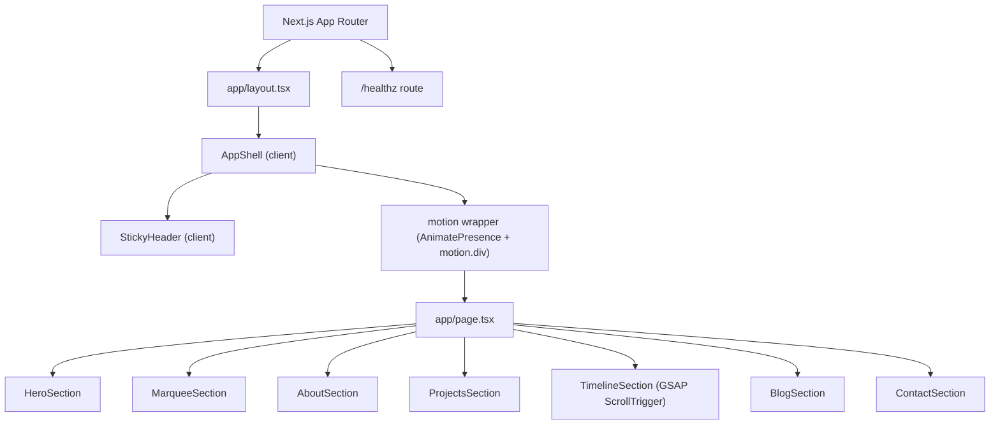

# Architecture (portfolio_frontend)

This document describes the architecture of the `portfolio_frontend` container, a Next.js App Router (app directory) application that renders a modern, animated single-page portfolio.

## High-level overview

The frontend is a single-page composition of multiple “section” components. The site uses:
- Next.js App Router for routing and layout composition.
- Tailwind CSS for styling and responsive layout.
- Framer Motion for component-level transitions, hover states, and viewport reveal animations.
- GSAP + ScrollTrigger for the pinned, scrubbed timeline animation.

The main architectural concept is to keep section content and layout in `components/sections/`, while shared UI and animation primitives live in `components/` and `components/motion/`.

## Request flow and runtime model

This application is primarily a static UI page served via Next.js. The main route is the homepage (`/`) and there is also a health endpoint.

### Routes
- `/` is implemented by `app/page.tsx` and is the single page that composes all sections.
- `/healthz` is implemented by `app/healthz/route.ts` and returns JSON `{ ok: true }` for container health checking.

## Next.js App Router structure

### `app/layout.tsx`
`app/layout.tsx` provides:
- Global metadata (`title`, `description`).
- Global stylesheet import via `app/globals.css`.
- A root `<html lang="en">` wrapper.
- An `AppShell` wrapper around all pages.

Because `AppShell` is a client component (it uses hooks and Framer Motion), it is imported from the server layout and wraps children at runtime.

### `app/page.tsx`
`app/page.tsx` is responsible for assembling the homepage. It imports section components and renders them in a fixed order:

- `HeroSection`
- `MarqueeSection`
- `AboutSection`
- `ProjectsSection`
- `TimelineSection`
- `BlogSection`
- `ContactSection`

The file also includes the footer that reiterates the accent colors and displays the current year.

## Component boundaries

### Application shell (`components/AppShell.tsx`)
`AppShell` is a client component that provides three key responsibilities:

1. A skip link (“Skip to top”) for accessibility.
2. A persistent sticky header (`StickyHeader`) for navigation.
3. An ambient, non-interactive background layer that renders blurred “orbs” using fixed positioning and `pointer-events: none`.
4. A simple page-level transition wrapper via `AnimatePresence` and a `motion.div` that animates opacity, vertical position, and blur on mount/exit.

In practice, because the current app is a single page, this transition mostly provides a polished initial load and any future route transitions if additional routes are added.

### Sticky header (`components/StickyHeader.tsx`)
`StickyHeader` is a client component that:
- Detects whether the page has been scrolled (`window.scrollY > 12`) to apply a blur/backdrop and border.
- Uses an `IntersectionObserver` to determine the most visible section and sets `activeId`.
- Provides nav buttons that call `element.scrollIntoView({ behavior: "smooth" })` for section navigation.

The header is styled with Tailwind utilities and uses Framer Motion to animate small underline indicators and backdrop blur transitions.

### Sections (`components/sections/*`)
All content sections are organized under `components/sections/`. Each section is implemented as a client component and typically uses:
- `ScrollReveal` for viewport entry motion on headings and content blocks.
- Framer Motion `motion.*` primitives for hover lift and subtle micro-interactions.
- Tailwind for layout, spacing, and theme application.

The `TimelineSection` is the primary exception in that it uses GSAP ScrollTrigger for pinned and scrubbed scrolling motion.

### Motion utilities (`components/motion/ScrollReveal.tsx`)
`ScrollReveal` is a reusable animation wrapper implemented with Framer Motion. It applies an initial “blur + translate down + fade” and transitions to “sharp + y=0 + fully opaque” when in view. It also disables these effects when `prefers-reduced-motion` is enabled (via `useReducedMotion()`).

## GSAP integration strategy

GSAP is integrated only where needed (timeline). `TimelineSection` uses dynamic imports:

- `await import("gsap")`
- `await import("gsap/ScrollTrigger")`

This approach avoids loading GSAP on initial bundles unnecessarily, and it also helps keep server rendering safe by only touching `window`/DOM APIs inside `useEffect`.

Within the effect:
- `gsap.registerPlugin(ScrollTrigger)` registers the plugin.
- A `gsap.timeline` is created with `scrollTrigger` configuration that pins the section, scrubs progress, and updates React state (`activeIndex`) based on scroll progress.

A cleanup function kills the timeline and all triggers to prevent leaks on unmount.

## Styling architecture

Styling is split into:
- Global CSS (`app/globals.css`) for base tokens and a few global animation utilities (marquee classes and the underline micro-interaction).
- Tailwind theme extensions (`tailwind.config.js`) defining `brand` color tokens, soft shadow, and marquee keyframes/animation.

## Container-level configuration

### `next.config.js`
The Next.js config enables `reactStrictMode` and allows toggling production browser source maps via:

`productionBrowserSourceMaps: process.env.NEXT_PUBLIC_ENABLE_SOURCE_MAPS === "true"`

This environment variable is documented in `docs/SETUP.md`.

## Key files

- `portfolio_frontend/app/layout.tsx`
- `portfolio_frontend/app/page.tsx`
- `portfolio_frontend/app/globals.css`
- `portfolio_frontend/app/healthz/route.ts`
- `portfolio_frontend/components/AppShell.tsx`
- `portfolio_frontend/components/StickyHeader.tsx`
- `portfolio_frontend/components/Marquee.tsx`
- `portfolio_frontend/components/motion/ScrollReveal.tsx`
- `portfolio_frontend/components/sections/TimelineSection.tsx`

## Architectural diagram

